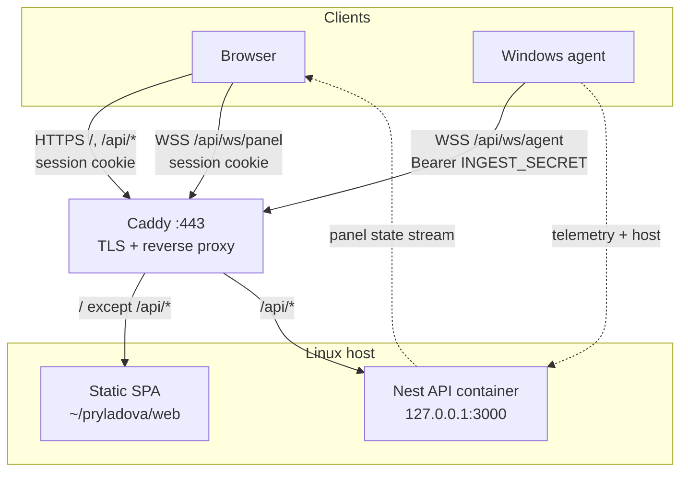

# Pryladova

Real-time desktop telemetry: a Windows agent reports the active window to a NestJS 12 (ESM) API; a React web panel displays the latest state.

Future work: [ROADMAP.md](ROADMAP.md).

## Prerequisites

- Node.js 22+
- pnpm
- Windows (agent)

## Install

Default (API + web + shared; skips Windows-native agent deps):

```powershell
pnpm install --filter "!agent"
```

Full install including the agent (Windows):

```powershell
pnpm install
```

## Run (local dev)

**All apps** (one terminal):

```powershell
pnpm dev
```

Or three terminals:

**1. API** — `http://localhost:3000`

```powershell
pnpm dev:api
```

Optional env — copy `apps/api/.env.example` to `apps/api/.env`:

| Variable | Default | Description |
|----------|---------|-------------|
| `GEMINI_API_KEY` | — | Google AI Studio key; without it classification is disabled |
| `GEMINI_MODEL` | `gemini-3.1-flash-lite` | Gemini model id for window classification |
| `INGEST_SECRET` | — | Shared secret for agent WebSocket (`Authorization: Bearer …`); required in production |
| `SESSION_SECRET` | (see `.env.example`) | Signs panel session cookies; required |
| `PANEL_PASSWORD_HASH` | (see `.env.example`) | Bcrypt hash for panel login (`caddy hash-password`); required |

When `GEMINI_API_KEY` is missing or the LLM call fails, telemetry is still stored with `classificationStatus: "failed"`.

Classification runs asynchronously after POST — the agent gets `204` immediately; the web panel may show a pending spinner verb until the result arrives.

**2. Agent** — active window + host metrics over WebSocket (`/api/ws/agent`)

```powershell
pnpm dev:agent         # local API (DEV_API_URL)
pnpm dev:agent:remote  # VPS API (API_URL)
```

Optional env — copy `apps/agent/.env.example` to `apps/agent/.env` (not committed; see `.gitignore`):

| Variable | Default | Description |
|----------|---------|-------------|
| `AGENT_PROFILE` | — | Set to `remote` for VPS API (same as `--remote` / `pnpm dev:agent:remote`) |
| `DEV_API_URL` | `http://localhost:3000` | Dev API origin (`pnpm dev:agent`) |
| `API_URL` | — | Remote API origin (`pnpm dev:agent:remote`) |
| `POLL_INTERVAL_MS` | `2000` | Poll interval (ms) |
| `INGEST_SECRET` | — | Must match API when ingest auth is enabled |
| `BLOCKED_APPS` | — | Comma-separated app names merged with the default blocklist |

**Host metrics** (local Win32 / SMTC, every poll): idle time, CPU%, RAM%, uptime, now playing. SMTC album art is sent when the active player exposes a thumbnail (no extra config).

**Agent privacy** (local, before POST):

- Blocked apps (password managers, SSH/RDP, crypto wallets, etc.) send `Secure` / `Redacted` instead of raw titles.
- Window titles keep tab names; emails and file paths are redacted to `[email]` and `[path]`.

**3. Web** — `http://localhost:5173` (proxies `/api` to the API)

```powershell
pnpm dev:web
```

Open the web URL and sign in (dev password in `apps/api/.env.example`). Telemetry appears after the agent connects. The panel streams state over WebSocket; login uses the session cookie on `/api/auth/*`. Click the weather chip to use browser location or search a city; choice is saved in the browser.

## Scripts

| Command | Description |
|---------|-------------|
| `pnpm dev` | API + agent + web in parallel |
| `pnpm dev:api` | NestJS API with watch |
| `pnpm dev:agent` | Telemetry agent (local API) |
| `pnpm dev:agent:remote` | Telemetry agent (remote VPS API) |
| `pnpm dev:web` | Vite dev server |
| `pnpm check` | Typecheck + lint + build (turbo) |
| `pnpm verify` | Full CI locally (same gates as GitHub Actions) |
| `pnpm build` | Build all packages (turbo) |
| `pnpm typecheck` | Typecheck all packages (turbo) |
| `pnpm lint` / `pnpm lint:fix` | Biome check / fix |
| `pnpm knip` | Unused exports and dependencies |
| `pnpm test` | Vitest (shared, api, web, agent privacy) |
| `pnpm test:coverage` | Vitest with coverage report |
| `pnpm test:e2e` | Playwright API → web panel |

## Testing

Automated coverage focuses on privacy, typed contracts, ingest auth, async classification, and the API → web stream path. Windows agent capture stays manual.

Before commit: `pnpm verify` (build, tests, coverage, e2e, knip, agent checks).

| Command | What |
|---------|------|
| `pnpm verify` | Full local CI — run before commit |
| `pnpm test` | Vitest unit + integration |
| `pnpm test:coverage` | Same, with lcov output |
| `pnpm test:e2e` | Playwright: login + agent WebSocket update → panel |

First-time E2E: `pnpm exec playwright install chromium`

## Production

Same three apps as local dev; production serves the built SPA from disk and routes `/api/*` through Caddy instead of the Vite dev proxy.

Single Linux host (currently Oracle VPS + DuckDNS). **Step-by-step runbook:** [`deploy/README.md`](deploy/README.md) (panel auth: `SESSION_SECRET`, `PANEL_PASSWORD_HASH` / `_B64`).



Dashed arrows = logical data flow over the connections above (not a separate network path).

| Piece | Where | Auto on push to `main`? |
|-------|-------|-------------------------|
| API container | `~/pryladova/` + [`docker-compose.yml`](docker-compose.yml) | Yes |
| Web static files | `~/pryladova/web/` | Yes |
| API secrets + panel auth | `~/pryladova/.env` ← [`deploy/env.example`](deploy/env.example) | No — edit on host |
| Caddy / TLS | `/etc/caddy/Caddyfile` (+ domain/root via [`deploy/host.env.example`](deploy/host.env.example)) | No — edit on host |
| Agent | `apps/agent/.env` on Windows | No — edit on PC |

Push to `main` → [CI](.github/workflows/ci.yml) must pass → [Deploy](.github/workflows/deploy.yml) builds the API image, uploads web + compose, restarts API.

Local `apps/api/.env` is for `pnpm dev` only.

## Layout

```
apps/agent   # Windows telemetry client
apps/api     # NestJS 12 API (ESM, in-memory state)
apps/web     # React + Vite + Tailwind v4
packages/shared   # Shared types and Zod schemas
deploy/           # runbook, bootstrap, Caddyfile, env examples
```
