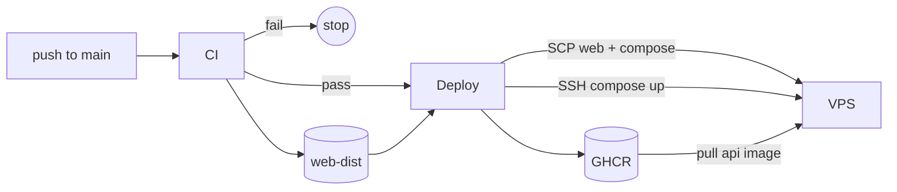
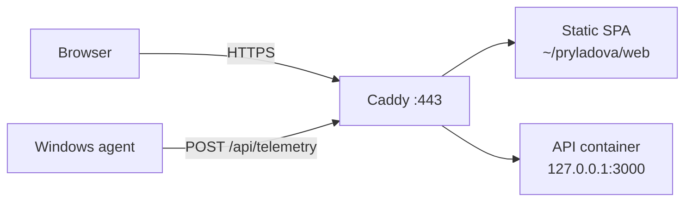

# Deploy runbook

Production = one Linux host. Caddy on the host; API in Docker; web as static files. **CI** runs on every merge to `main`; **Deploy** runs only after CI succeeds.

## Mental model

Two views — **what happens on merge** and **what runs in prod**.

### Deploy pipeline



1. **CI** — typecheck, lint, build, test; uploads `web-dist`.
2. **Deploy** — builds API Docker image, pushes to GHCR, SCPs static files + compose, restarts API on VPS.
3. Deploy runs **only if CI passed** (including the Windows agent job).

### Production runtime



Caddy, `.env`, and Caddyfile are configured **once on the host** — not touched by CI.

| Location | Path | Deployed by CI? |
|----------|------|-----------------|
| API secrets | `~/pryladova/.env` | No — edit on host |
| SPA static files | `~/pryladova/web/` | Yes — SCP each deploy |
| Docker Compose | `~/pryladova/docker-compose.yml` | Yes — SCP each deploy |
| Caddy domain / web root | `/etc/caddy/pryladova.env` | No — edit on host |
| Caddy routing / panel auth | `/etc/caddy/Caddyfile` | No — edit on host |
| Agent config | `apps/agent/.env` on your PC | No — local dev only |

**Not auto-deployed:** `~/pryladova/.env`, Caddy config, agent env. Change those on the host/PC yourself.

## Files in this folder

| File | Used by | Purpose |
|------|---------|---------|
| [`bootstrap.sh`](bootstrap.sh) | Host (once) | Create `~/pryladova/web`, seed API `.env` |
| [`env.example`](env.example) | API container | Template for `~/pryladova/.env` |
| [`host.env.example`](host.env.example) | Caddy | Template for `/etc/caddy/pryladova.env` |
| [`Caddyfile`](Caddyfile) | Caddy | TLS, routing, basic auth for panel |
| [`../docker-compose.yml`](../docker-compose.yml) | Host Docker | Runs API image on `127.0.0.1:3000` |
| [`uptime-kuma/docker-compose.yml`](uptime-kuma/docker-compose.yml) | Host Docker (optional) | Self-hosted uptime UI on `127.0.0.1:3002` |

## Two env files (easy to mix up)

| File on host | Variables | Consumed by |
|--------------|-----------|-------------|
| `~/pryladova/.env` | `INGEST_SECRET`, `GEMINI_*`, `SENTRY_*`, `PORT` | API Docker container |
| `/etc/caddy/pryladova.env` | `PRYLADOVA_DOMAIN`, `PRYLADOVA_WEB_ROOT` | Caddy process |
| `/etc/caddy/Caddyfile` | Panel `basic_auth` bcrypt hash | Caddy (server-only; not in env) |

Same name pattern on `.env` files, different jobs. API secrets never go in the Caddy env file.

## First-time host setup

On the Linux host (Ubuntu assumed; adjust paths if user is not `ubuntu`).

### 1. Prerequisites

- Docker Engine + Compose plugin
- [Caddy](https://caddyserver.com/docs/install)
- DNS A record for your domain → host IP (e.g. DuckDNS)

### 2. Bootstrap API layout

```bash
git clone https://github.com/heigee/pryladova.git   # or your fork
cd pryladova
chmod +x deploy/bootstrap.sh
./deploy/bootstrap.sh
```

Edit API env:

```bash
nano ~/pryladova/.env
# Required: INGEST_SECRET=<long random string>
# Optional: GEMINI_API_KEY, GEMINI_MODEL
# Optional: SENTRY_DSN=<same DSN as VITE_SENTRY_DSN>
# SENTRY_RELEASE is injected by deploy (git sha); do not set manually.
```

### 3. Caddy edge config

**Env file** (domain + web root):

```bash
sudo cp deploy/host.env.example /etc/caddy/pryladova.env
sudo nano /etc/caddy/pryladova.env
```

Set `PRYLADOVA_DOMAIN` and `PRYLADOVA_WEB_ROOT` (usually `/home/<user>/pryladova/web`).

Load env into Caddy (systemd drop-in):

```bash
sudo mkdir -p /etc/systemd/system/caddy.service.d
sudo tee /etc/systemd/system/caddy.service.d/pryladova.conf <<'EOF'
[Service]
EnvironmentFile=/etc/caddy/pryladova.env
EOF
sudo systemctl daemon-reload
```

**Caddyfile** (routing + panel password hash):

```bash
# Option A: this app is the only site on the host
sudo cp deploy/Caddyfile /etc/caddy/Caddyfile

# Option B: other sites already on the host — add to existing Caddyfile:
#   import /home/ubuntu/pryladova/deploy/Caddyfile
```

Replace both `REPLACE_WITH_BCRYPT_HASH` lines in `/etc/caddy/Caddyfile` with your hash (`caddy hash-password`). **Do not commit the real hash.** When updating the Caddyfile from repo later, re-paste your existing hash.

```bash
sudo caddy validate --config /etc/caddy/Caddyfile --envfile /etc/caddy/pryladova.env
sudo systemctl restart caddy
```

`validate` needs `--envfile` — without it `{$PRYLADOVA_DOMAIN}` is empty, the opening `{` becomes a global block, and `@ingest` errors. Use `restart` (not `reload`) after changing `pryladova.env`.

### 4. GitHub Actions secrets and variables

Repo → **Settings** → **Secrets and variables** → **Actions**. Two tabs:

| Tab | Used for |
|-----|----------|
| **Secrets** | Tokens, SSH keys, hosts |
| **Variables** | `VITE_SENTRY_DSN` (Sentry client DSN for web build) |

`gh secret list` shows secrets only. Run `gh variable list` to verify variables.

#### Secrets tab

| Secret | How to get it |
|--------|----------------|
| `VPS_SSH_KEY` | Private key that can SSH as deploy user |
| `VPS_HOST` | Host IP or hostname |
| `VPS_USER` | SSH user (optional; default `ubuntu`) |
| `VPS_SSH_KNOWN_HOST` | `ssh-keyscan -H <VPS_HOST> 2>/dev/null` |
| `SENTRY_AUTH_TOKEN` | Sentry organization **`org:ci`** token — [details](#sentry-from-scratch) |
| `SENTRY_ORG` | Sentry organization slug |
| `SENTRY_PROJECT` | Sentry project slug |

#### Variables tab

| Variable | Value |
|----------|-------|
| `VITE_SENTRY_DSN` | Sentry project **Client DSN** (baked into SPA at build). Deploy reads `vars.VITE_SENTRY_DSN`, with `secrets.VITE_SENTRY_DSN` as fallback. |

Sentry optional — deploy succeeds without it. See [Sentry (from scratch)](#sentry-from-scratch).

Ensure the deploy user can run `docker` without sudo (in `docker` group):

```bash
sudo usermod -aG docker <USER>
```

### 5. First deploy

Merge to `main`. Workflow builds image, uploads web + compose, restarts API container.

### 6. Windows agent (remote API)

`apps/agent/.env` on your PC:

```env
API_URL=https://<PRYLADOVA_DOMAIN>
INGEST_SECRET=<same value as ~/pryladova/.env>
```

```powershell
pnpm dev:agent:remote
```

Startup logs `profile=remote api=https://...`. Local API stays `pnpm dev:agent` (`DEV_API_URL`).

## Uptime Kuma (optional, self-hosted)

Lightweight uptime UI (~50–80 MB RAM). Not auto-deployed — one-time manual setup on the host. Binds to localhost only; use SSH port-forward or Caddy in front if you want remote access.

```bash
mkdir -p ~/uptime-kuma/data
cp deploy/uptime-kuma/docker-compose.yml ~/uptime-kuma/
cd ~/uptime-kuma
docker compose up -d
```

From your PC:

```powershell
ssh -L 3002:127.0.0.1:3002 ubuntu@<VPS_HOST>
```

Open `http://localhost:3002`, create the admin user, then add monitors:

| Monitor | URL | Notes |
|---------|-----|-------|
| Edge (recommended) | `https://<PRYLADOVA_DOMAIN>/api/health` | Full stack; set HTTP basic auth (same as panel) |
| API container | `http://pryladova-api:3000/api/health` | Only after joining Kuma to the API compose network (see below) |

The API binds to `127.0.0.1:3000` on the host, so `http://host.docker.internal:3000` from a default-bridge container will **not** reach it. Prefer the Caddy edge URL, or attach Kuma to the API network:

```yaml
# ~/uptime-kuma/docker-compose.yml — add under uptime-kuma service:
networks:
  - default
  - pryladova

networks:
  pryladova:
    external: true
    name: pryladova_default   # docker network ls — match the API compose project
```

Add a notification (Telegram, email, etc.) under Settings → Notifications.

## UptimeRobot (optional, external)

Free SaaS uptime checks from outside the VPS. Catches whole-host outages that [Uptime Kuma](#uptime-kuma-optional-self-hosted) cannot (Kuma runs on the same VPS).

1. Sign up at [uptimerobot.com](https://uptimerobot.com)
2. Add monitor → type **HTTP(s)** → URL `https://<PRYLADOVA_DOMAIN>/api/health`
3. Interval **5 minutes**; add alert contact (email or Telegram)
4. **HTTP auth:** enable basic auth with the same user/password as the Caddy panel (`/api/*` is protected)
5. Optional keyword: `ok`

## Observability

What catches what:

| Check | Tool | Where | Setup |
|-------|------|-------|-------|
| API container down (host alive) | Uptime Kuma | VPS Docker | Manual — [above](#uptime-kuma-optional-self-hosted) |
| Whole VPS / edge down | UptimeRobot | SaaS | Manual — [above](#uptimerobot-optional-external) |
| React JS crashes | Sentry + Error Boundary | SaaS | GitHub vars/secrets + VPS `.env` |
| Nest 5xx / unhandled | Sentry | SaaS | VPS `SENTRY_DSN` in `.env` |
| Prod-only bugs before merge | Prod E2E | CI | Automatic in `pnpm verify` — rejects error-boundary fallback |

Client-side crashes also log to the browser console as `[web:client-error]` and show a reload fallback via the React error boundary.

### Sentry (from scratch)

One Sentry project covers both the React panel and the Nest API. The repo already initializes the SDK — you only need credentials and env vars.

**Web vs API DSN:**

| Surface | Env var | Where you set it |
|---------|---------|------------------|
| React panel | `VITE_SENTRY_DSN` | GitHub Actions **variable** → CI web build |
| Nest API | `SENTRY_DSN` | VPS `~/pryladova/.env` → restart API container |

Same DSN string for both. VPS `.env` alone does not enable browser reporting — you need the GitHub variable and a redeploy.

#### Where values come from (general)

| Value | Scope in Sentry | How to identify it |
|-------|-----------------|-------------------|
| **DSN** | Project | Project settings → client keys / DSN. Public ingest URL for that project. |
| **`SENTRY_ORG`** | Organization | Organization **slug** — short name in URLs (`/organizations/<slug>/`) or org settings. Not the numeric `o…` id embedded in the DSN. |
| **`SENTRY_PROJECT`** | Project | Project **slug** — short name in URLs (`/projects/<slug>/`) or project settings. Not the numeric id at the end of the DSN. |
| **`SENTRY_AUTH_TOKEN`** | Organization or user | **Organization auth token** with scope **`org:ci`** (Sentry’s CI token — releases + source maps). Or a personal token with release/source-map permissions. CI only; not the DSN. |
| **`SENTRY_RELEASE`** | — | Set by **deploy** to the git sha (web at build time, API at `docker compose up`). Omit from VPS `.env`. Shown in panel footer (web) and `GET /api/health` (API). |

Use one project’s DSN and slugs consistently if you created multiple projects.

Official references (UI changes over time): [DSN](https://docs.sentry.io/product/sentry-basics/concepts/dsn-explainer/), [Auth tokens](https://docs.sentry.io/product/accounts/auth-tokens/) (organization **`org:ci`** token is the usual choice for deploy).

#### Setup steps

1. Create a Sentry project (React platform is fine).
2. Collect DSN, org slug, project slug, and auth token from the table above.
3. **GitHub** → repo → Settings → Secrets and variables → Actions:
   - **Variables:** `VITE_SENTRY_DSN`
   - **Secrets:** `SENTRY_AUTH_TOKEN`, `SENTRY_ORG`, `SENTRY_PROJECT`
4. **VPS** — add to `~/pryladova/.env`:
   ```env
   SENTRY_DSN=<same DSN>
   ```
   Restart API: `docker compose -f ~/pryladova/docker-compose.yml up -d` (or wait for the next deploy — CI sets `SENTRY_RELEASE` to the git sha on each deploy).
5. Merge to `main` (or re-run Deploy). CI uploads source maps when the three Sentry secrets are set; EU DSNs auto-use `https://de.sentry.io` (override with `SENTRY_URL` in the deploy workflow if needed). Upload failure fails the build. Maps are not deployed to `~/pryladova/web/`.
6. Open the live panel. Issues may show a sample event until the first real error from your app.

Without Sentry configured, the app runs normally — SDK init is skipped when DSN is empty.

## What each deploy does

From [`.github/workflows/deploy.yml`](../.github/workflows/deploy.yml) (triggered after [CI](../.github/workflows/ci.yml) succeeds on `main`):

1. Build + push `ghcr.io/heigee/pryladova-api:<sha>` (and `:latest`)
2. Download `web-dist` artifact from the CI run (web built there with Sentry env)
3. SSH: `mkdir -p ~/pryladova/web`
4. SCP `docker-compose.yml` → `~/pryladova/`
5. SCP `apps/web/dist/*` → `~/pryladova/web/`
6. Remote: `docker login ghcr.io` → pull `api` only if `<sha>` image missing locally → `docker compose up -d` with `IMAGE_TAG=<sha>` → `docker logout ghcr.io`

Web files update immediately. API restarts with the pinned image tag. No Caddy reload unless you changed Caddy config manually.

## GHCR login on the host

Deploy logs in to GHCR over SSH for each run, pulls if needed, then **logs out** so credentials are not left in `~/.docker/config.json`.

Optional — persist pulls without plaintext tokens (recommended if you pull manually often):

```bash
# Ubuntu: store registry creds in pass
sudo apt install pass gnupg
gpg --generate-key   # if you do not already have a key
pass init "<your gpg-id>"
echo "https://<github-user>:<read-packages-pat>@ghcr.io" | docker login ghcr.io --username <github-user> --password-stdin
# Docker writes to ~/.docker/config.json with "credsStore": "pass"
```

Use a fine-grained PAT with **read:packages** only. Deploy workflow does not rely on this — it uses ephemeral login/logout.

## Verify

On the host:

```bash
curl -s http://127.0.0.1:3000/api/health          # {"ok":true,"release":"<git-sha>"}
docker compose -f ~/pryladova/docker-compose.yml ps
```

Optional external uptime: [UptimeRobot](#uptimerobot-optional-external). Self-hosted internal uptime: [Uptime Kuma](#uptime-kuma-optional-self-hosted).

From your PC:

```bash
# Panel (will prompt for basic auth)
curl -u admin: https://<PRYLADOVA_DOMAIN>/api/telemetry

# Ingest (replace SECRET)
curl -X POST https://<PRYLADOVA_DOMAIN>/api/telemetry \
  -H "Authorization: Bearer SECRET" \
  -H "Content-Type: application/json" \
  -d '{"appName":"Test","windowTitle":"Hi","capturedAt":"2026-01-01T00:00:00.000Z"}'
```

## Routing reference

| Request | Edge auth | App auth |
|---------|-----------|----------|
| `GET /` (SPA) | Caddy basic auth | — |
| `GET /api/*` (panel) | Caddy basic auth | — |
| `POST /api/telemetry`, `POST /api/host` | None | Nest `INGEST_SECRET` Bearer |

## Troubleshooting

| Symptom | Check |
|---------|-------|
| 502 on `/api/*` | `docker compose ps` in `~/pryladova`; `curl localhost:3000/api/health` |
| Agent 401 | `INGEST_SECRET` match between agent `.env` and `~/pryladova/.env` |
| Panel 401 | Caddy `basic_auth` user/password; hash in `/etc/caddy/Caddyfile` |
| Caddy fails to start | `sudo caddy validate --config /etc/caddy/Caddyfile --envfile /etc/caddy/pryladova.env`; env vars set? |
| `docker pull` 403 | GHCR package visibility; deploy workflow logs in via `GITHUB_TOKEN` |
